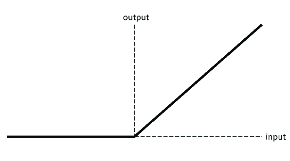

# **ReLU**

::: neuraltoolkit.modules.activations.relu.Relu

```python
ntk.Relu()
```

`Relu` (Rectified Linear Unit) is an activation function that directly outputs the input values if positive and 0 if negative.

