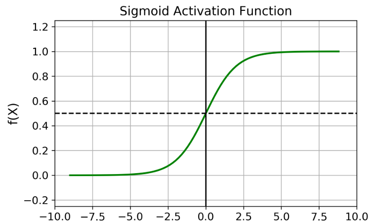

# **Sigmoid**

::: neuraltoolkit.modules.activations.sigmoid.Sigmoid

```python
ntk.Sigmoid()
```

The `Sigmoid` activation function maps all real-values into an output strictly between zero and 1 on a continuous curve.


