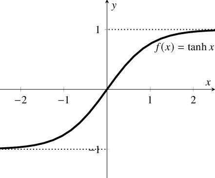

# **Tanh**

::: neuraltoolkit.modules.activations.tanh.Tanh

```python
ntk.Tanh()
```

The `Tanh` (Hyperbolic Tangent) activation function maps all real-values into an output strictly between -1 and 1 on a continuous curve.

