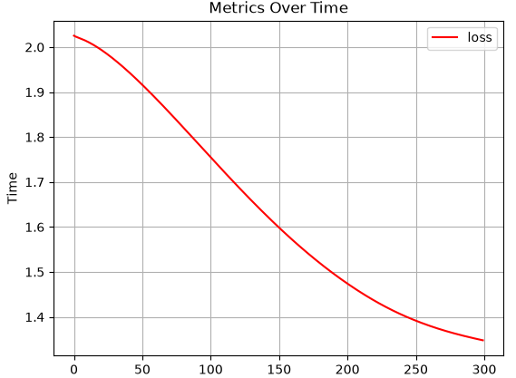

# **Trainer**

::: neuraltoolkit.training.trainer.Trainer

## **Implementatino**
```python
trainer = ntk.Trainer(
    model=my_model,
    optimizer=ntk.Adam(parameters=my_model.parameters()),
    loss=ntk.BinaryCrossEntropy()
)

history = trainer.fit(dataloader, epochs=300)
history.plot("loss")
```
#### History Plot Output


## History Metrics

The `History` object tracks two training metrics (with more to come), loss and validation loss, which can be plotted like so:
```python
history.plot("loss", "val_loss")
```