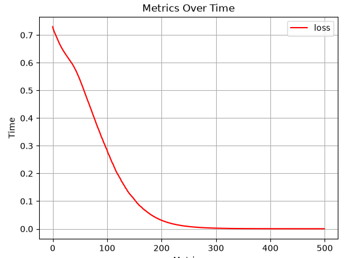
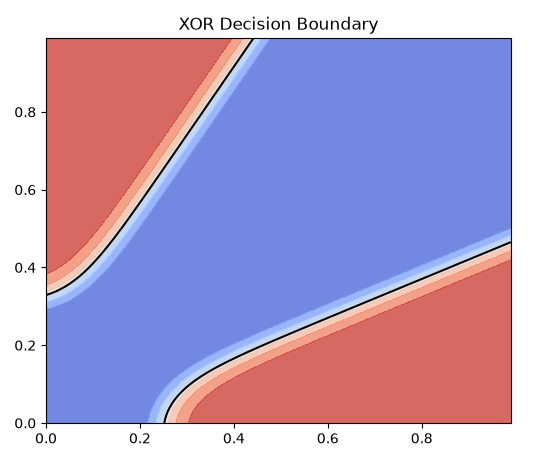

# **XOR**
XOR is an excellent first test for anyone new to deep learning, or for ensuring that everything is running properly. Below is a plug-and-play example that you can paste into any IDE, or Python environment. Taking a closer look at the code should give you a good understanding of the basic flow and syntax of NTK.

This example demonstrates the most basic implementation of NTK. It covers simple tensor abstraction. The creation of layers and linking them togehter through a sequential module. A simple training setup, via the trainer module. Tracking basic training metrics, and querying the model, post training.

```python
import neuraltoolkit as ntk
import numpy as np
import matplotlib.pyplot as plt

x = ntk.Tensor([
    [0, 0],
    [0, 1],
    [1, 0],
    [1, 1]
])

y = ntk.Tensor([
    [0],
    [1],
    [1],
    [0]
])

model = ntk.Sequential(
    ntk.Dense(in_shape=2, out_shape=4),
    ntk.Tanh(),
    ntk.Dense(in_shape=4, out_shape=1),
    ntk.Sigmoid()
)

trainer = ntk.Trainer(
    module=model,
    optimizer=ntk.Adam(parameters=model.parameters(), learning_rate=0.01),
    loss=ntk.BinaryCrossEntropy()
)


history = trainer.fit(x, y, epochs=500)
print(model(x))
history.plot("loss")

# ----------------------Visualizing-------------------------

# defining a boundary
x_min, x_max = 0, 1
y_min, y_max = 0, 1

#Creating the grid
step_size = 0.01
xx, yy = np.meshgrid(
    np.arange(x_min, x_max, step_size),
    np.arange(y_min, y_max, step_size)
)

grid_points = np.c_[xx.ravel(), yy.ravel()]
with ntk.no_grad():
    predictions = model(ntk.Tensor(grid_points))

Z = predictions.data.reshape(xx.shape)
print(Z)

# Plotting

plt.figure(figsize=(6, 5))
plt.contourf(xx, yy, Z, alpha=0.8, cmap="coolwarm")
plt.contour(xx, yy, Z, colors='k', levels=[0.5], linewidths=1.5)

plt.title("XOR Decision Boundary")
plt.show()
```

## Plots
### Loss Curve
Within a couple hundred epochs the model should memorize the dataset. The curve should quickly bottom out and flatline



### Decision Boundary
The model should produce a clean decision boundary separating the distinct XOR features.

